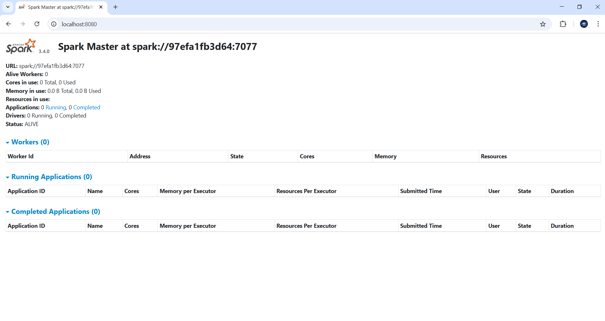
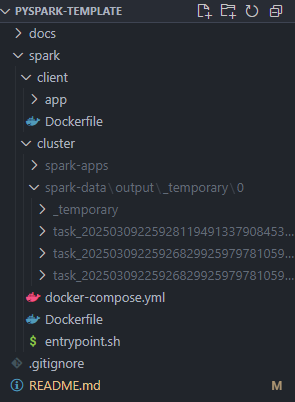

# PySpark Cluster

This project sets up a Spark cluster using Docker containers. It allows you to run python distributed data processing tasks using Apache Spark and pyspark library.


## Spark Cluster set-up

1. **Clone the Repository**

   ```bash
   $ git clone <repository-url>
   $ cd pyspark-template
   ```

2. **Run Docker Daemon**
   Run Docker Desktop to start Docker Daemon

3. **Access spark/docker folder**

   ```bash
   $ cd spark/docker
   ```

4. **Build Docker Image**

   ```bash
   $ docker build -t spark-image:3.4.0 .
   ```

5. **Build the Docker Image**
   Navigate to the `spark/docker` directory and build the Docker image:

   ```bash
   $ docker-compose build
   ```

6. **Start the Spark Cluster**
   Use Docker Compose to start the cluster:

   ```bash
   docker-compose up
   ```

7. **Access the Spark UI**
   The Spark UI can be accessed at `http://localhost:9090`.

   

## PySpark client set-up using Docker

1. Access `spark/client` folder

```bash
cd spark/client
```

2. Edit the Python code inside the `main.py` file with the code. This code will be executed in a distributed manner on the Spark cluster.

3. Build the Spark client Docker image. The Spark client will push the code to the Spark master node, which is responsible for distributing the computing workload across the worker nodes within the Spark cluster.

```bash
docker build -t spark-client:latest .
```

4. Run the Spark Client and the pyspark job. Include the Spark client within the same network as the cluster so that both can communicate.

```bash
docker run --network=cluster_default --name spark-client-app
-e HOSTNAME=spark-client --rm spark-client:latest
```

5. The computational workload will be distributed across the worker nodes. The result can be viewed within the `spark-apps` and `spark-data` folders of the attached volumes.

   

## PySpark local set-up using Windows

Install JAVA and set JAVA_HOME environment variable.

Install Apache Hadoop and set APACHE_HADOOP environment variable.

Access to pyspark folder:

```console
$ cd pyspark
```

List python versions:

```console
$ py --list
```

Use a specific python version:

```console
$ py -3.13 <command>
```

Create python virtual environment:

```console
$ py -m venv .venv
```

Activate python virtual environment:

```console
$ .venv\scripts\activate
```

Update pip package installer

```console
$ pip3 install --upgrade pip
```

Add your requirements to "requirements.txt" file.

Install the requirements:

```console
$ python -m pip install -r requirements.txt
```

Select your .venv as Python Interpreter in VSCode to enable code linting with Pylance. Click Ctrl+Shift+P and type "Python: Select Interpreter" and select you ".venv" python executable.

To run your PySpark application, modify the `src/main.py` file with your data processing logic. You can use the utility functions defined in `src/utils/helper.py` to assist with data loading and transformation.

```console
$ py main.py
```

docker build -t spark-client:latest .

docker run --network=cluster_default --name spark-client-app
-e HOSTNAME=spark-client --rm spark-client:latest

## License

This project is licensed under the MIT License.
