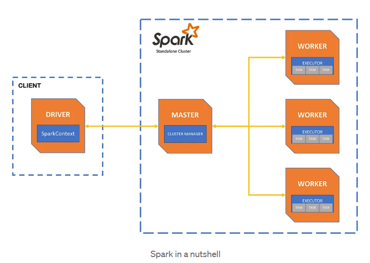

# PySpark Cluster

This project sets up a Spark cluster using Docker containers. It allows you to run python distributed data processing tasks using Apache Spark and pyspark library on a Jupyter Server Client.

## License

This project is licensed under the MIT License.
