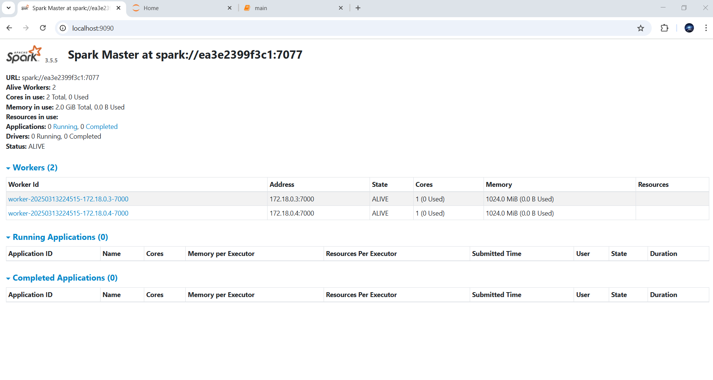
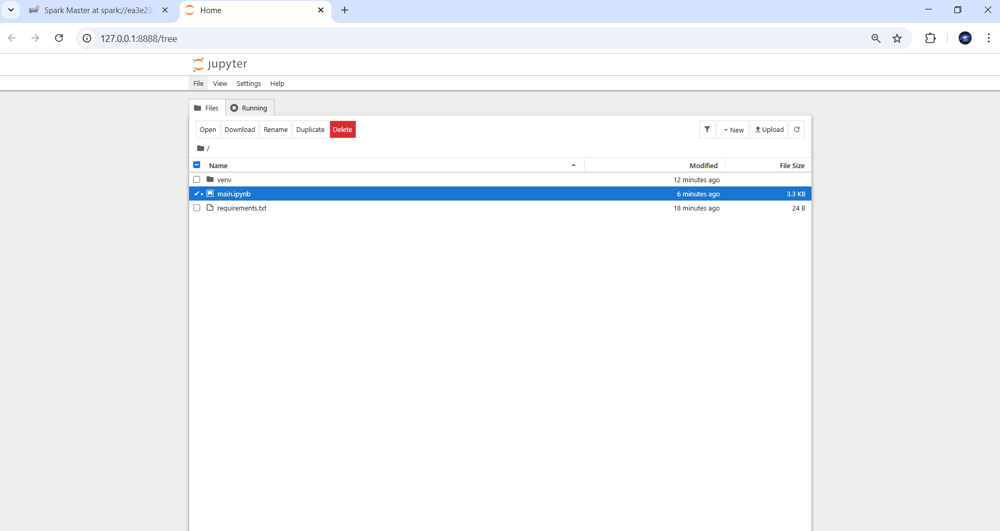
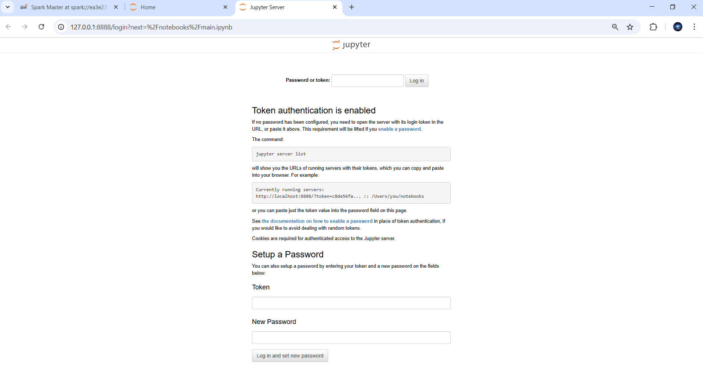
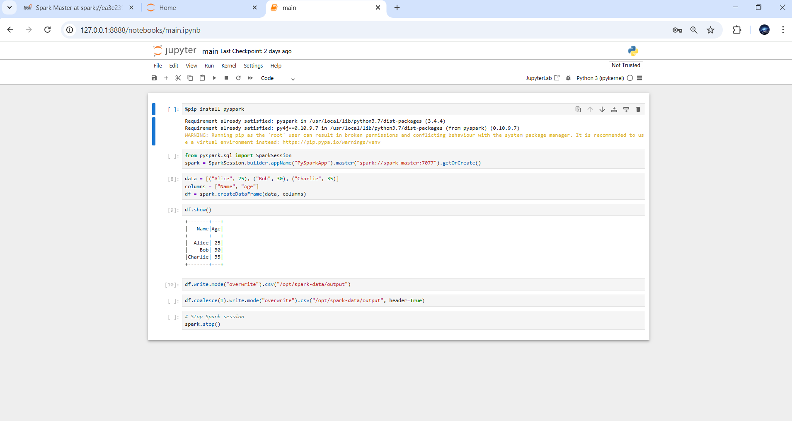
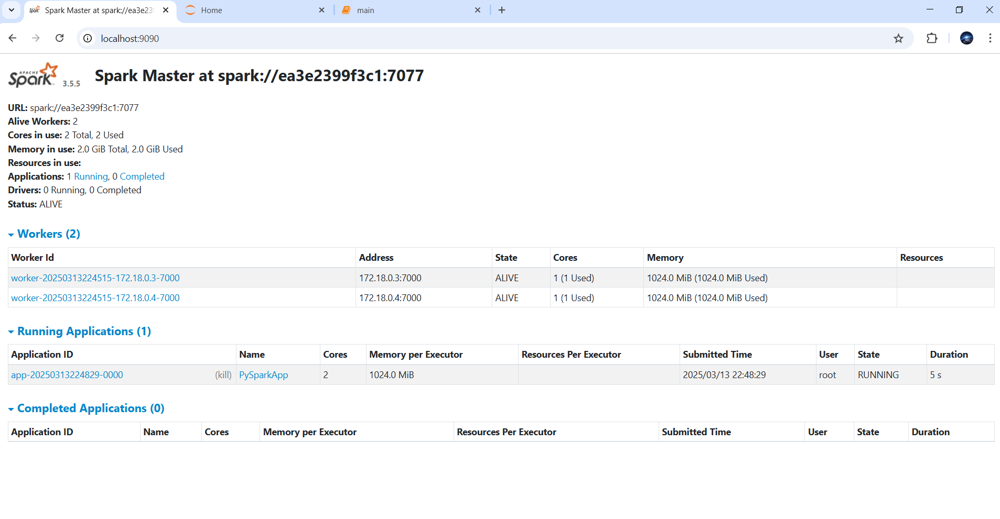
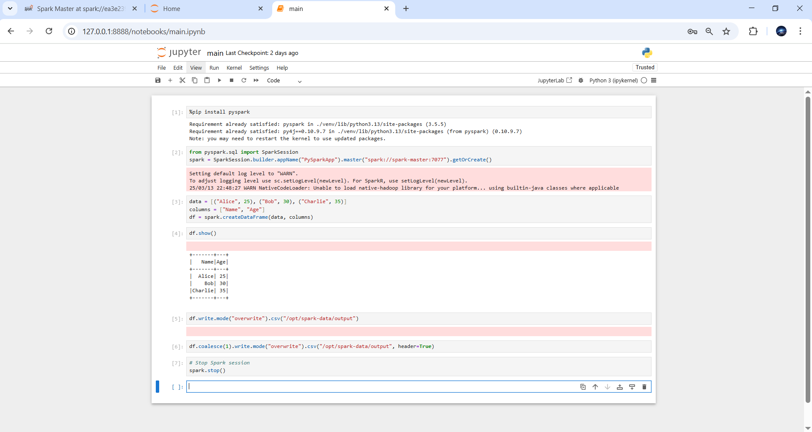
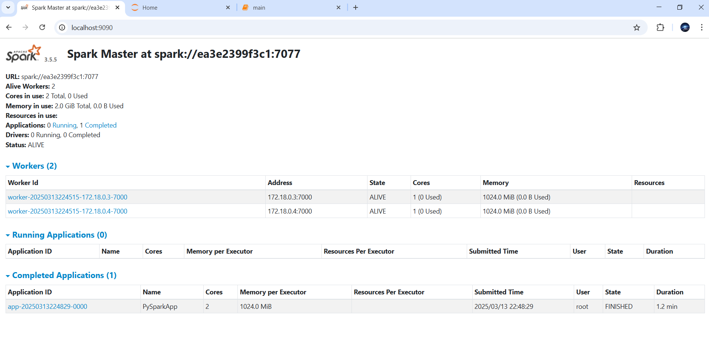
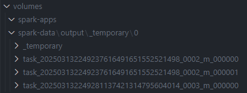

# python313jupyterpyspark

This project sets up a Jupyter Server with python v3.13 using Docker container.

## python313jupyterpyspark set-up

1. **Navigate to the python313jupyter directory**

   ```bash
   cd src/docker/images/python/python313jupyterpyspark
   ```

2. **Run Docker Daemon**
   Run Docker Desktop to start Docker Daemon

3. **Build the Spark client Docker image**
   The Spark client will push the code to the Spark master node, which is responsible for distributing the computing workload across the worker nodes within the Spark cluster.

```bash
docker build -t python313jupyterpyspark:latest .
```

4. **Run the Spark Cluster**
   by following spark355 image and cluster compose documentation.



5. **Get Spark Cluster Network**
   by following executing the following command.

```bash
PS C:\Downloads\pyspark-template\src\docker\images\python\python313jupyterpyspark> docker network ls
NETWORK ID     NAME               DRIVER    SCOPE
23025453faa6   bridge             bridge    local
92cd11a24163   host               host      local
490782e3e403   none               null      local
4e23dd4b9e86   spark355_default   bridge    local
```

6. Run the Spark Client and the pyspark job. Include the Spark client within the same network as the cluster so that both can communicate.

```bash
docker run --network=spark355_default -e HOSTNAME=spark-client -p 8888:8888 python313jupyterpyspark:latest
```

7.  Access the Jupyter Notebook server inside the docker container (localhost:8888).



8.  Run `main.ipynb` file which contains the spark job code. You will have to introduce the prompted token by Jupyter Server in the Docker Image logs.





9.  The computational workload of the main.ipynb program will be distributed across the spark worker nodes.

Once started the spark session initializing the job with this line of code:

```python
spark = SparkSession.builder.appName("PySparkApp").master("spark://spark-master:7077").getOrCreate()
```

A Running Application will appear in the spark interface.



Once all the code is executed the job is stopped, an the application will appear as completed.





10. The final results can be viewed within the `volumes/spark-apps` and `volumes/spark-data` attached volumes of the worker nodes.


