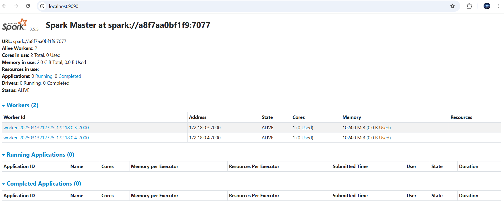

# spark:3.5.5

This project sets up a Spark cluster using Docker containers.

## Spark Cluster set-up

1. **Navigate to the spark:3.5.5 directory**

   ```bash
   cd src/docker/images/spark/spark355
   ```

2. **Run Docker Daemon**
   Run Docker Desktop to start Docker Daemon

3. **Access spark/docker folder**

   ```bash
   cd spark/docker
   ```

4. **Build Docker Image**

   ```bash
   docker build -t spark:3.5.5 .
   ```

5. **Build the Docker Image**
   Navigate to the `spark/docker` directory and build the Docker image:

   ```bash
   docker-compose build
   ```

6. **Start the Spark Cluster**
   Use Docker Compose to start the cluster:

   ```bash
   docker-compose up
   ```

7. **Access the Spark UI**
   The Spark UI can be accessed at `http://localhost:9090`.

   
